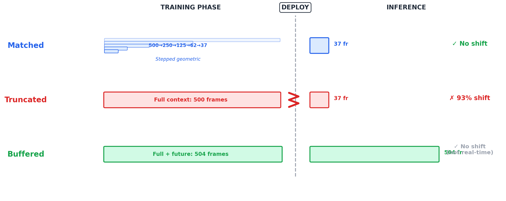

# LatBOND: Latency-Budgeted Onset and Note Detection

**Does training neural networks under the same latency constraints used at deployment improve real-time music transcription accuracy?**

[](https://www.python.org/downloads/)
[](https://pytorch.org/)
[](LICENSE)
[](#citation)

---

## Overview

LatBOND investigates a critical gap in real-time automatic music transcription (AMT): **when models trained on full audio sequences are deployed with finite memory, input truncation creates distribution shift that degrades accuracy.** This work builds directly on [Hu et al. (ISMIR 2025)](https://arxiv.org/abs/2509.07586) who demonstrated that making transcription models real-time causes F1 to drop from 67% to 37%, but never explored training methodology solutions.

We introduce **matched training** — training models under the same memory constraints they will face at deployment — and demonstrate through a 42-model benchmark that this consistently outperforms the standard practice of training without constraints.

### Key Results

| Phase | Setup | Finding |
|-------|-------|---------|
| **Phase 1** (Demo Lite v11) | 3 architectures × 2 conditions @ 20ms | Matched > Truncated across all architectures (*p* < 0.001) |
| **Curriculum Ablation** (v3.3.7) | 3 architectures × 3 conditions @ 40ms | Without curriculum: Matched < Truncated (F1 0.459 vs 0.477) |
| **Phase 2** (v3.3.10) | 3 architectures × 5 budgets × 3 conditions | Matched > Truncated across all 15 combinations (+0.87 pp avg) |

<p align="center">
  
</p>

### The Three Training Conditions

| Condition | Training Context | Test Context | Distribution Shift? |
|-----------|-----------------|--------------|:-------------------:|
| **Matched** (LatBOND) | Curriculum: 500→target frames | RF + budget frames | ✗ No |
| **Truncated** (Current practice) | Full 500 frames | RF + budget frames | ✓ Yes |
| **Buffered** (Upper bound) | Full 500 frames | Full 500 frames | ✗ No (not real-time) |

---

## Repository Structure

```
LatBOND/
├── demo_lite_v11/          # Phase 1: Proof-of-concept (6 models, single GPU)
│   ├── models/             # Streaming CNN, Causal Transformer, TCN
│   ├── training/           # Trainer with cosine curriculum, AsymmetricFocalLoss
│   ├── evaluation/         # Tolerance-based F1, visualization
│   ├── data/               # MAESTRO dataset loader (5% subset)
│   ├── config.py           # All hyperparameters
│   ├── run_demo.py         # Main entry point
│   └── ablation_results/   # Focal loss ablation study
│
├── full_study_v3310/       # Phase 2: Full 42-model benchmark (GCP Vertex AI)
│   ├── models/             # Same architectures, scaled for production
│   ├── training/           # Stepped geometric curriculum, deployment-aligned validation
│   ├── evaluation/         # Statistical analysis suite
│   ├── data/               # MAESTRO loader (30% subset)
│   ├── scripts/            # Vertex AI entrypoint, GCS integration
│   ├── config.py           # Full study configuration
│   ├── run_full_study.py   # Orchestrator for all 42 models
│   ├── verify_rf.py        # Empirical receptive field verification
│   ├── Dockerfile          # Vertex AI training container
│   └── requirements.txt    # Python dependencies
│
├── ablation_v337/          # Curriculum ablation: proves curriculum is necessary
│   ├── training/           # No curriculum (fixed target context from epoch 1)
│   ├── scripts/            # 9-model pilot launcher
│   └── ...                 # Same structure as v3310
│
├── results/                # Experimental results and analysis
│   └── latbond_v3310_42model_dataset.csv
│
├── docs/                   # Documentation and figures
│   ├── VERSION_HISTORY.md  # Detailed codebase evolution
│   └── figures/            # Thesis figures
│
├── LICENSE                 # MIT License
├── CITATION.cff            # Citation metadata
└── README.md               # This file
```

---

## Architectures

All three architectures are **strictly causal** (no future lookahead), matching the real-time constraint:

| Architecture | Receptive Field | Parameters | Key Property |
|-------------|:--------------:|:----------:|-------------|
| **Streaming CNN** | 32 frames | ~250K | Dilated causal convolutions [1,2,4,8] |
| **Causal Transformer** | 32 (design) / unbounded (attention) | ~450K | Masked self-attention over sliding window |
| **TCN** | 62 frames | ~350K | 4 residual blocks × 2 causal convolutions |

Each produces **triple-head output**: onset logits, offset logits, and velocity estimates.

---

## The Stepped Geometric Curriculum

The core technical innovation. Matched models train with a 5-stage context reduction schedule:

```
Stage 1 (Warm-up):    Epochs  1–20  →  500 frames  (full context)
Stage 2:              Epochs 21–34  →  250 frames  (½)
Stage 3:              Epochs 35–48  →  125 frames  (¼)
Stage 4:              Epochs 49–62  →   62 frames  (⅛)
Stage 5 (Fine-tune):  Epochs 63–100 →  target      (deployment context)
```

**Why it matters:** Without this curriculum (v3.3.7 ablation), matched training *underperforms* truncated by 1.8 pp. With curriculum (v3.3.10), matched *outperforms* truncated by 0.87 pp — a total swing of 2.67 pp attributable solely to gradual adaptation.

---

## Quick Start

### Phase 1: Demo Lite (Single GPU, ~6 hours)

```bash
cd demo_lite_v11

# Download MAESTRO dataset (5% subset)
python data/download_maestro.py

# Train and evaluate all 6 models (3 architectures × 2 conditions)
python run_demo.py
```

**Requirements:** Python 3.10+, PyTorch 2.1+, single GPU with ≥8GB VRAM (T4 or better).

### Phase 2: Full Study (GCP Vertex AI)

```bash
cd full_study_v3310

# Build Docker container
gcloud builds submit \
  --tag us-central1-docker.pkg.dev/YOUR_PROJECT/latbond/training:v3.3.10 \
  --region=us-central1

# Launch all 42 models
python run_full_study.py --project YOUR_PROJECT --region us-central1
```

**Requirements:** GCP project with Vertex AI API enabled, NVIDIA A100 (matched) / L4 (truncated/buffered) GPUs.

### Receptive Field Verification

```bash
cd full_study_v3310
python verify_rf.py
```

Outputs empirically verified RF for each architecture using gradient backpropagation.

---

## Results Summary

### Phase 2: Matched vs. Truncated (v3.3.10)

| Architecture | Matched F1 | Truncated F1 | Δ (pp) | Buffered F1 |
|-------------|:----------:|:------------:|:------:|:-----------:|
| Streaming CNN | 0.5375 | 0.5295 | **+0.80** | 0.8157 |
| Causal Transformer | 0.5557 | 0.5455 | **+1.02** | 0.8545 |
| TCN | 0.4954 | 0.4874 | **+0.80** | 0.8321 |
| **Grand Average** | **0.5295** | **0.5208** | **+0.87** | **0.8341** |

The 31 pp gap between buffered (0.8341) and truncated (0.5208) quantifies the performance ceiling imposed by deployment truncation. Matched training recovers +0.87 pp of this gap.

### Phase 1: Demo Lite v11 (20ms budget)

| Architecture | Matched F1 | Truncated F1 | Δ (pp) | *p*-value |
|-------------|:----------:|:------------:|:------:|:---------:|
| Streaming CNN | 0.3349 | 0.3261 | +0.88 | < 0.001 |
| Causal Transformer | 0.2844 | 0.2781 | +0.63 | 0.00047 |
| TCN | 0.4271 | 0.4062 | +2.09 | < 0.001 |

---

## Codebase Version History

| Version | Role | Key Change |
|---------|------|-----------|
| **v1–v10** | Demo Lite iterations | Architecture exploration, loss tuning |
| **v11** | Phase 1 final | Triple-head output, AsymmetricFocalLoss, cosine curriculum |
| **v3.3.3** | GCP port | Tolerance-based F1 (±2 frames), per-budget LR scaling |
| **v3.3.4** | RF verification | Empirical RF (CNN=32, TCN=62); curriculum removed (later reversed) |
| **v3.3.5** | Validation fix | Truncated validation corrected to use constrained context |
| **v3.3.6** | Performance | Validation: 9,000s → 6s/epoch (vectorized tolerance F1) |
| **v3.3.7** | **Curriculum ablation** | No curriculum → matched < truncated (critical negative result) |
| **v3.3.8–9** | Curriculum restoration | Cosine → stepped geometric; deployment-aligned validation |
| **v3.3.10** | **Phase 2 final** | Stepped geometric curriculum; 42-model benchmark; matched 100ep |

See [`docs/VERSION_HISTORY.md`](docs/VERSION_HISTORY.md) for detailed changelogs.

---

## Dataset

[MAESTRO v3.0.0](https://magenta.tensorflow.org/datasets/maestro) (MIDI and Audio Edited for Synchronous TRacks and Organization):

- **200+ hours** of virtuosic piano performances with aligned MIDI
- **Phase 1:** 5% stratified subset (~10 hours)
- **Phase 2:** 30% stratified subset (~60 hours)
- **Split:** Train/Validation/Test following MAESTRO canonical splits

The dataset is automatically downloaded by `data/download_maestro.py`.

---

## Technical Details

### Audio Processing
- **Sample rate:** 16 kHz
- **STFT:** 2048 FFT, 160 hop (10ms frames), 229 mel bins
- **Causal STFT:** `center=False` for deployment-aligned preprocessing
- **Input:** Mel spectrogram + spectral flux (230 channels)

### Training
- **Loss:** TripleHeadLoss = AsymmetricFocalLoss(γ⁺=1.0, γ⁻=3.0) + 0.5 × OffsetLoss + 0.1 × VelocityMSE
- **Optimizer:** Adam (lr=1e-3 for CNN/TCN, 3e-4 for Transformer)
- **LR Schedule:** Cosine annealing with 3-epoch warmup
- **Matched:** 100 epochs, patience=30, stepped geometric curriculum
- **Truncated/Buffered:** 50 epochs, patience=15, full 500-frame context
- **Seed:** 42 (single seed; multi-seed planned for extension)

### Evaluation
- **Metric:** Micro-averaged onset F1 with ±2 frame tolerance (±20ms)
- **Threshold:** Sweep 0.05–0.80 (16 values), best selected per model
- **Test inference:** Deployment-constrained sliding window for matched/truncated

---

## Citation

If you use this code or reference this work, please cite:

```bibtex
@mastersthesis{shivdasan2025latbond,
  title     = {{LatBOND}: Latency-Budgeted Onset and Note Detection},
  author    = {Shivdasan, Anuroop Ashok},
  school    = {University of Europe for Applied Sciences},
  year      = {2025},
  type      = {Master's Thesis},
  note      = {MSc Data Science, 60 ECTS}
}
```

This work builds on:

```bibtex
@inproceedings{hu2025lowlatency,
  title     = {Exploring Low-Latency Music Transcription},
  author    = {Hu, Yujia and others},
  booktitle = {Proceedings of ISMIR},
  year      = {2025}
}
```

---

## License

This project is licensed under the MIT License — see the [LICENSE](LICENSE) file for details.

---

## Acknowledgments

- **Supervisors:** Prof. Dr. Iftikhar Ahmed and Prof. Dr. Talha Ali Khan (University of Europe for Applied Sciences)
- **Infrastructure:** Google Cloud Platform (Vertex AI with NVIDIA A100 and L4 GPUs)
- **Dataset:** [MAESTRO](https://magenta.tensorflow.org/datasets/maestro) by Google Magenta

---

## Future Work

- Multi-seed evaluation for confidence intervals
- Multi-dataset validation (MAPS, IDMT-SMT drums, Böck onset datasets)
- Curriculum schedule optimization (stepped geometric vs. cosine vs. linear vs. adaptive)
- Architecture-specific curriculum tuning
- Cross-domain application (speech processing, medical signal analysis)
